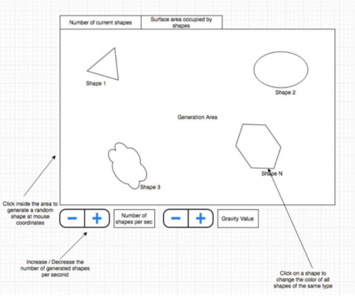

# PIXI SHAPES
Test Task
### Required:

    1. PIXI, HTML elements, CSS, TypeScript
    2. OOP
    3. MVC structure
    4. Source-code in the public git repository

Would be a plus:
    
    1. brief build/deployment manual in Readme.md
    2. a few screenshots of the test-app / working example

### Requirements
Create a rectangular area.
Inside the rectangular area generate random shapes with random colours.
The shapes must fall down from top to bottom (the generated position is outside the top of the rectangle, the
bottom position is outside the bottom of the rectangle). The falling is controlled by the Gravity Value,
If you click inside the rectangle, a random shape of random colour will be generated at mouse position and start
falling.
If you click a shape, it will disappear.
Shape types:
3 sides, 4 sides, 5 sides, 6 sides, circle, ellipse, random (example Shape 3)

### Visualization:
In the top left you will have two HTML text fields, one showing the number of shapes being displayed in the
rectangle. The other text field shows the surface area (in px^2) occupied by the shapes.
In the bottom you will add a couple of controls (HTML):
-/+ increase or decrease the number of shapes generated per second (update the text field accordingly)
-/+ increase or decrease the gravity value (update the text value accordingly)

